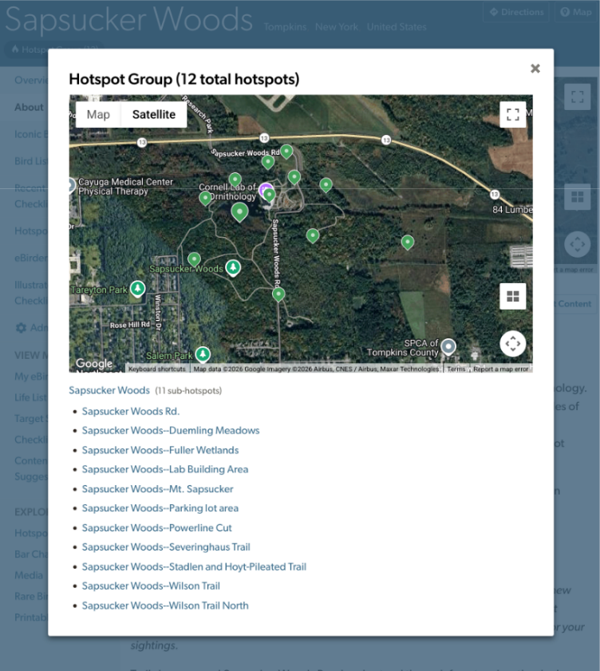
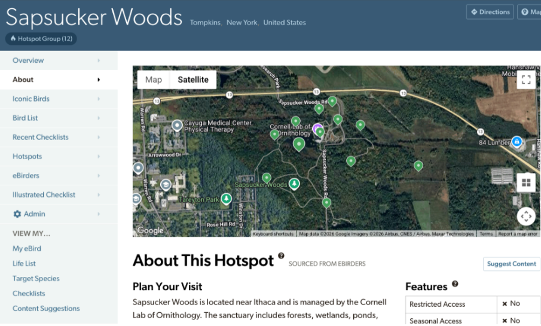
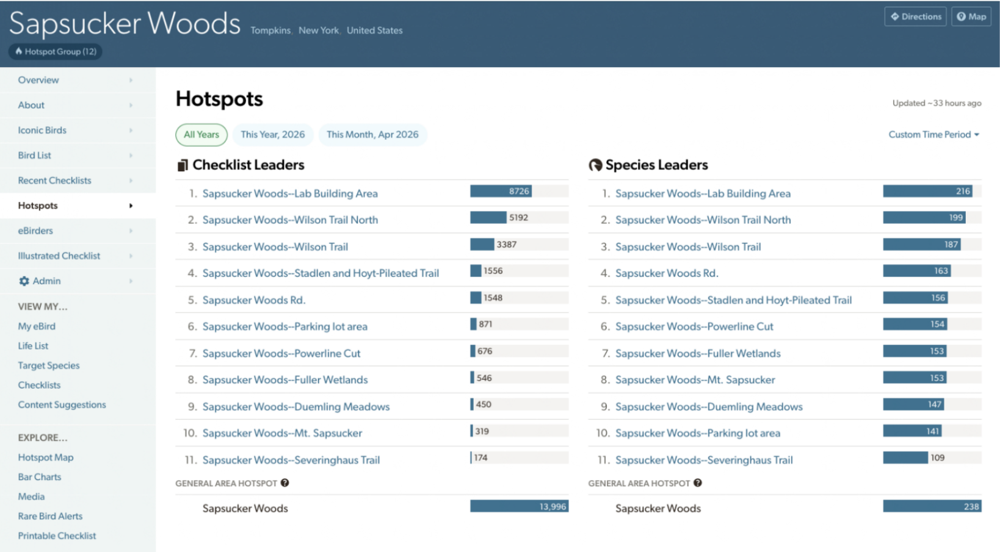

## **Additional Parent Hotspot UI**

### **Group Map**

When you visit the Parent hotspot page (the group overview page), you will see a map of all hotspots in the group. 

{fig-align="center"}

{fig-align="center"}

### **Hotspot Standings**

Each parent hotspot has a 'Hotspots' page that lists all hotspots within that group, ranked by number of checklists and species—similar to the Hotspot and Subregion rankings found on eBird Region pages. The checklist and species totals for the parent hotspot are displayed separately at the bottom of the page. 

