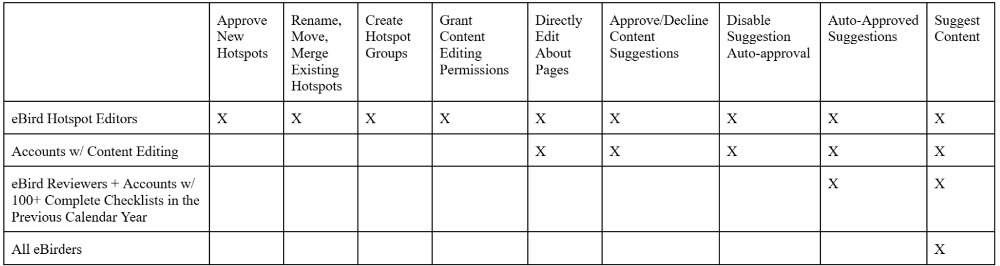

## **Content Permissions**

-   **All eBirders:** Can suggest new content or changes to existing content

-   **eBird Reviewers AND eBirders with 100+ complete checklists in the previous calendar year:** Content suggestions are automatically approved (except for sites with Auto-approval turned “Off”)

-   **Accounts with Content Editing permissions:** All of the above, plus the ability to:

    -   Approve/Decline pending content suggestions

    -   View content suggestion history

    -   Directly edit About pages (including adding links)

    -   Disable suggestion Auto-approval on individual hotspots

-   **eBird Hotspot Editors:** All of the above, plus:

    -   Approve new Hotspots

    -   Rename, move, merge, and demote existing hotspots

    -   Create or edit Hotspot Groups

    -   Grant content editing permissions (to any subregion(s) within their assigned hotspot region)

Additional content editing permissions can be granted to accounts to assist with content management. 

{fig-align="center"}