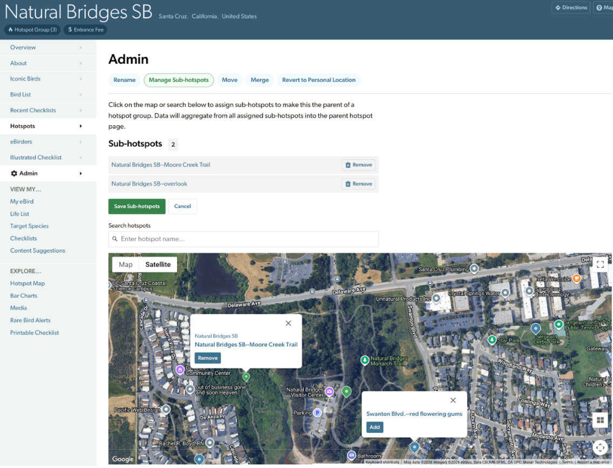

## **Creating and Managing Hotspot Groups**

Only eBird Hotspot Editors can create and manage Hotspot groups. 

#### **Create a Hotspot Group**

1.  Navigate to the hotspot you want to act as the parent location

    1.  From the Hotspot map: Locate and tap the appropriate Hotspot pin, then click the **Edit** link (upper right corner).

    2.  From an individual Hotspot page: Tap **Admin** from the navigation sidebar

2.  Tap **Manage Sub-hotspots**

3.  Locate nearby hotspots on the map or use the search bar to look them up by name (another good reason to have the parent location in all sub-hotspot names!) 

4.  Once a pin is selected on the map, tap the **Add** button to add that hotspot to the group

5.  Tap the **Remove** button on the Sub-hotspots list to remove a hotspot from the group

    1.  You can also tap a pin on the map and, if it is already part of the group, tap Remove to remove it. 

6.  IMPORTANT: Tap the **Save Sub-hotspots** button to save your changes

#### **Dissolve a Hotspot Group**

1.  Follow steps 1 and 2 from **Create a Hotspot Group** (above) to access the **Manage Sub-hotspots** tab on the Parent Hotspot’s Adminpage. 

2.  Tap **Remove** next to each sub-hotspot in the Sub-hotspots list

3.  Once all sub-hotspots are removed, the hotspot will no longer function as a parent location and the group will effectively no longer exist