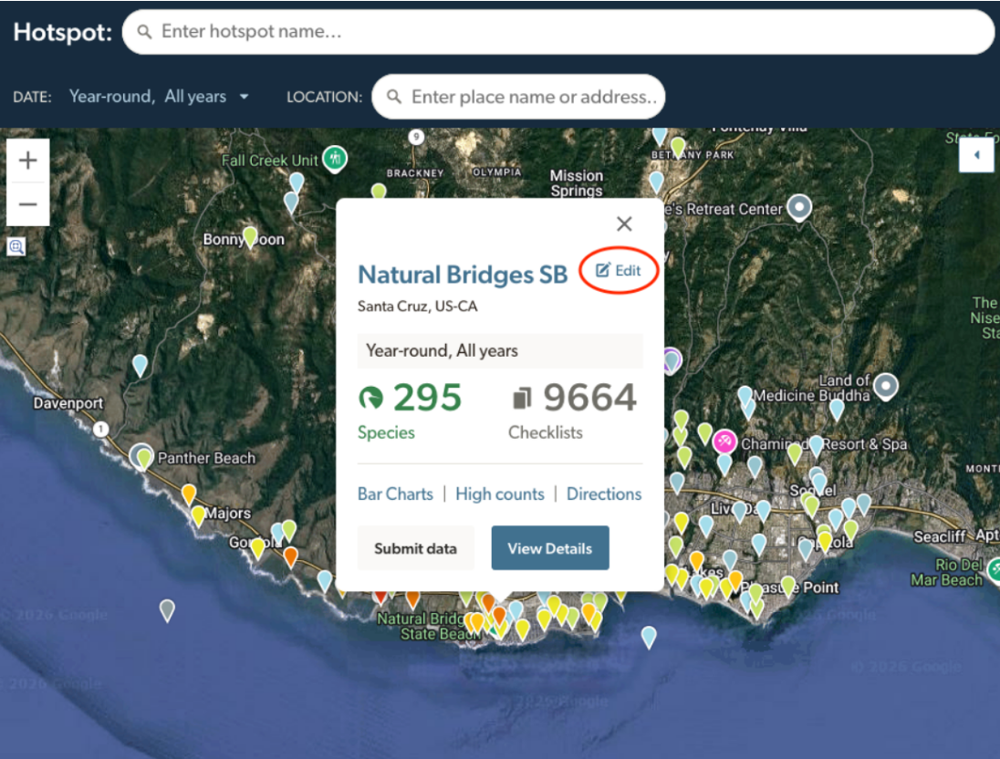
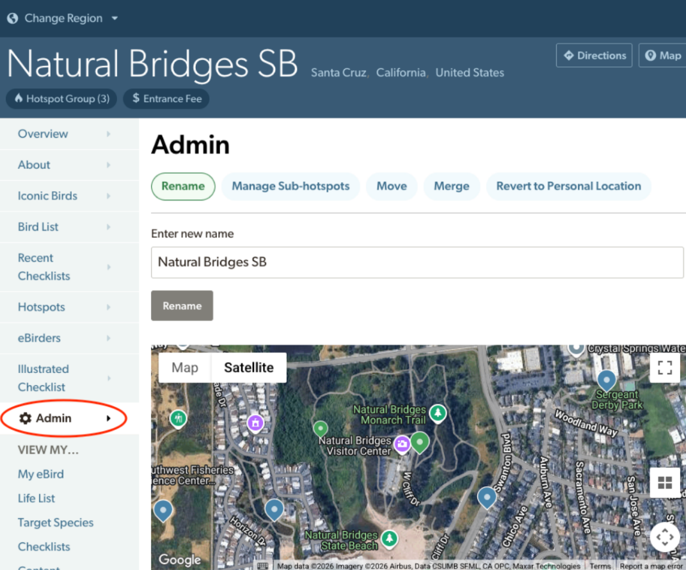
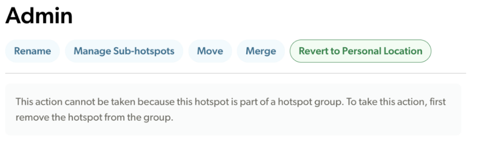

## **Editing Existing Hotspots**

Existing hotspots can be renamed, moved, merged, deleted, and reverted to personal locations using the Hotspot Explorer in eBird. 

1.  Sign in to eBird.

2.  Navigate to the hotspot you wish to edit. Easy ways to do that include:

    1.  Click the hotspot name from an eBird checklist.

    2.  Find it on the eBird Hotspot map (https://ebird.org/hotspots). 

    3.  Select it from the list of hotspots on a region page (top 100 hotspots only).

3.  From the Hotspot map: Click the **Edit** link to open the Edit Location page.\
    From an individual Hotspot page: Tap **Admin** from the navigation sidebar

{fig-align="center"}

{fig-align="center"}

**Rename**—To change the hotspot name, select the **Rename** option, type the new name, and click **Rename**. (See [Part IV: Standards and Naming Conventions for eBird Hotspots](Part4.qmd))

**\
Manage Sub-Hotspots**—[see Hotspot Groups](Part3.qmd)

**Move—**To move the hotspot, select the **Move** option, click on the map to plot the new location, and then click **Move** again. (See [Plotting Hotspots](PlottingHotspots.qmd)) **NOTE:** If you know the coordinates of the new location, enter them in the **Zoom to:** box, press the **\<Enter\>** key, and then click **Move**.

**Merge—**See [Merging Hotspots](MergingHotspots.qmd). To merge two hotspots, select the **Merge** option. The map will display the surrounding hotspots as red pins, and the hotspot you’re working with will be shown as an /orange pin with a plus sign. Click the hotspot that you want to merge your current hotspot \*INTO\*, select the **Delete after merging** check box, and then click **Merge**. Be careful! Merging cannot be undone. **NOTE:** If you do not select Delete after merging, the old hotspot will persist with no data.

\
**Revert to Personal Location—**Reverts a hotspot to a personal location. If the personal location that is created is shared among several observers, the one with the oldest checklist (i.e., the first checklist ever submitted for the site, not the oldest observation date) will become the "owner" of the location and is  responsible for any moves, renaming, or merging of this location, and also is the only one able to recommend it again as a hotspot. **NOTE:** You can still find these in the “Reviewed” tab if you want to reverse your decision.

{fig-align="center"}

Above: You will not be able to revert a hotspot to a personal location if it is part of a Hotspot Group. 

**Delete—**You do not have the option to delete a hotspot unless it has no data associated with it. In this case, a blue **delete** option appears next to the name. There is little point in maintaining hotspots with no data, unless you are confident they will be useful in the future. Please delete these if you deem it appropriate.