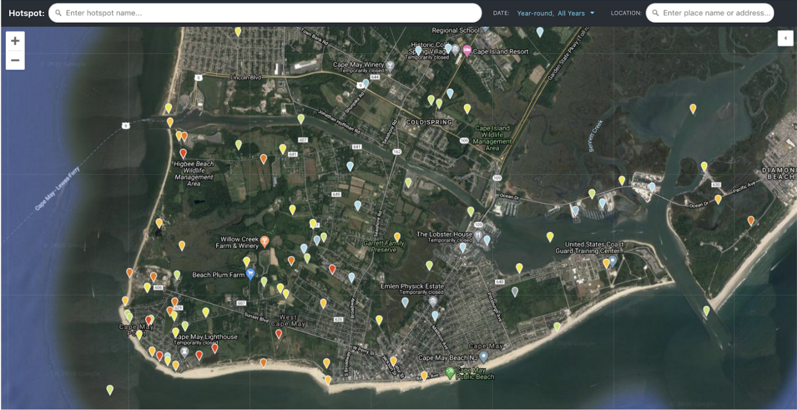

## **Hotspot Definitions and Hierarchy**

Most hotspots are discrete, continuous sites that accurately represent a geographical region—often defined by land ownership or conservation status. Typical hotspots can also be thought of as representing birder behavior within those properties, including a walking or driving path (i.e., track) and typical strategies for looking for birds. One could theoretically draw a boundary to represent any hotspot (this functionality might be added to eBird in the future to more formally define these areas).

**Most hotspots should be coverable in a discrete birding event**, most typically either 1) stationary count at a certain vantage point (e.g., [Shaumta Raptor Watchpoint](https://ebird.org/hotspot/L6314444)); 2) a traveling count described by a long (e.g., [Reserva Ecológica Costanera Sur](https://ebird.org/hotspot/L472208)) or short (e.g., [Brooklyn Bridge Park](https://ebird.org/hotspot/L1902982)) linear, out-and-back, looped, or meandering walking route; 3) or a traveling count involving short legs by car, bike, or foot that is broken up by stops at key locations or vantage points, such as along a wildlife drive (e.g., [Edwin B. Forsythe NWR--Wildlife Drive](https://ebird.org/hotspot/L92448) or [Carretero Satipo](https://ebird.org/hotspot/L2305198)).

Many hotspots represent a single, discrete, stand-alone site. However, in some cases there are many hotspots in a small area, and within those areas there may be discrete hierarchy of hotspots that may include a parent hotspot, several sub-hotspots, and occasionally an overarching “grandparent” hotspot (see [Hotspot Groups](Part3.qmd))

As a general rule, Hotspot Groups should contain sites that are all part of the same management unit, such as a state park, a national wildlife refuge, or a city park. A hierarchical naming structure can also be used even when sites are not part of an “official” Hotspot Group, such as along particularly good sections of birding roads, rivers, or trails (see [Linear Routes](LinearRoutes.qmd) below). 

**Fig. 1.** Cape May Point area, showing the large number of hotspots (red, orange, yellow, and blue pins) south of the Cape May Canal, which runs through the middle of this image.