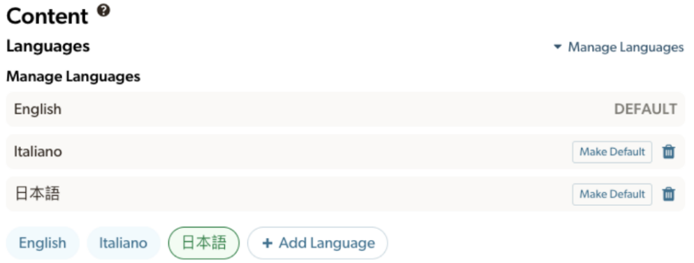

## **Managing Languages**

\
Which language is displayed first?

1.  If a user has the eBird website or their browser set to a particular language, we first display About content in that language, if available.

2.  If no content is available in the user's browser/web language, we then try to display content in the regional default language, if applicable. (e.g., For eBird Japan, the regional default language is Japanese. For eBird Chile, the regional default language is Spanish)

3.  If there is no content in either the user's preferred language or the regional default language, we will show ANY available content.\* 

4.  Finally, if there is no content at all, we display a message "Nothing added yet for this hotspot. Suggest content"

5.  Note that bird names that use the species tags will always display for logged-in users according to the user’s [common name preferences](https://ebird.org/prefs), regardless of the other language settings.

\* Whenever multiple languages are available, go to Edit Content \> Manage Languages to choose which language is displayed first. 

{fig-align="center"}

**If a language has no content**: Go to Edit Content \> Manage Languages to delete it. (Be careful, this will also delete any existing content!)