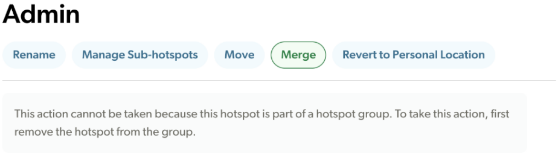

## **Merging Hotspots**

When you merge two hotspots, the data from two locations is combined into a single hotspot. For example, if hotspot A is plotted correctly, but hotspot B has a similar name and is plotted nearby (and is a clear duplicate), you should merge hotspot B \*into\* hotspot A. In almost all cases, you should also select the "Delete after merging” check box so that the hotspot you merged the data from (in this case hotspot B) will be deleted. 

**Note:** Please be VERY careful when merging and deleting hotspots as this action cannot be reversed. 

ALWAYS KEEP MORE REFINED LOCATIONS SEPARATE FROM THE MAIN LOCATION \[e.g., DO NOT MERGE “Rocky Mountain NP--Endovalley Campground” into the “Rocky Mountain NP (Larimer Co)” hotspot\].

{fig-align="center"}

Above: This warning appears if you attempt to Merge any hotspot that is actively part of a Hotspot Group.