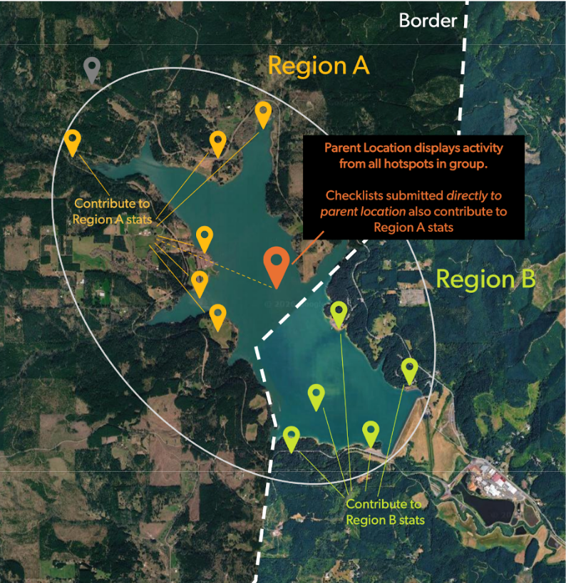

## **Multi-Region Hotspot Groups**

#### **Can a Hotspot Group Include Locations from Multiple Regions?**

Yes! Hotspot groups can cross geopolitical boundaries. This does not mean an individual checklist will appear in multiple counties. 

#### **What is the Expected Behavior When a Group Spans Multiple Regions?**

Parent hotspots display checklist activity from all sub-locations in the group. If the group covers multiple regions, data from multiple counties could appear on the parent hotspot page. This does NOT feed into greater county, state/province, or country-level data. Each hotspot counts toward only one county, one state/province, and one country's birding activity. Individual hotspots only contribute data to the regions where they are located.

In the example Hotspot Group above, only checklists submitted to hotspots in Region A or submitted directly to the parent location will appear in Region A stats. Checklists from hotspots in Region B will also appear on the parent location page, but only count towards Region B stats. 

### **Should a Hotspot Group Include Locations from Multiple Regions?**

We understand that reviewers may hesitate to create groups where the parent hotspot aggregates data from multiple regions, as it could inadvertently lead to data from one county being submitted to a parent location in another county. If you have concerns about this, please see our guidance below. 

#### **Large Areas**

For hotspot groups that cross borders because they cover large areas (e.g., national parks, wildlife refuges), we are implementing a special “large area process”: any hotspot group with a bounding area greater than 80km2 will be designated a [List Building Location](List-buildingParentHotspots.qmd) (see above). 

#### **Small Areas**

Hotspot groups \<80km2 can still span multiple geopolitical regions. Common examples include bridges or dams that cross borders along rivers. 

When the same habitats exist on both sides of a geopolitical border (e.g., a road or arbitrary line cutting through a forest), the birds found on either side should be very similar—it would be hard to tell from a single checklist which side of the border the observer was on if you didn’t know the exact location. 

Conversely, when geopolitical boundaries follow strong ecological boundaries (e.g., Pima and Santa Cruz counties in Madera Canyon) the species lists of two hotspots just across the border from each other might be dramatically different—it’s easy to tell which side a checklist came from. 

When people submit checklists directly to the parent hotspot of a group, their observations will “roll up” into the county, state/province, and country where the parent hotspot is located. (Note: it is almost never best practice to submit to a parent hotspot, since finer-scale locations are always preferable)

So, if the main goal is maintaining accurate **regional** data, the key question is: will creating a Hotspot Group (under 80km²) clearly disrupt regional data where the parent hotspot is located? 

**Consider these questions:**

-   Do most birds cross freely from one side of the border to the other?

-   Could you tell which side of the border a checklist was from simply by looking at the species list and counts? 

-   Do the habitat conditions found on one side also exist in the other county, and vice versa?

-   Are species lists, high counts, and arrival/departure dates generally similar on each side of the border?

If you answered "Yes" to these questions—assuming all other [hotspot group criteria](Overview.qmd) are met—then a multi-region hotspot group shouldn’t cause meaningful regional data problems. (Very long traveling checklists can still cause regional data problems, so continue to be vigilant for those!)