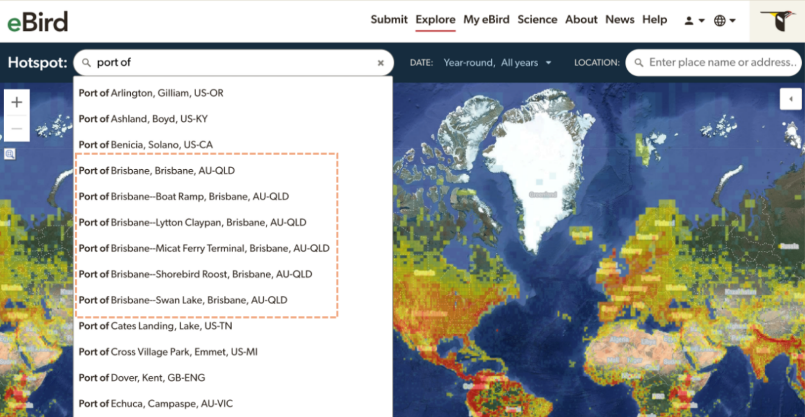

## **Naming Parent Hotspots and Sub-hotspots**

Follow [Hotspot Naming policies](index.qmd). Parent locations should have “general” or “general area” in the name if there could be confusion between a precise site and the overarching area. 

Sub-hotspots do not HAVE to include the parent location in the name. In other words, you can form Hotspots groups where sub-hotspots follow mixed naming practices, some with the parent location in the name and some without. 

Sub-hotspots SHOULD have the parent location at the beginning of their name, followed by double-dash (--) and the sub-hotspot descriptor unless the sub-hotspot is an obvious and well-known standalone location. 

Including the parent location in the subhotspot name is helpful to ensure hotspots from the same area are grouped together in dropdown lists and search results.

{fig-align="center"}