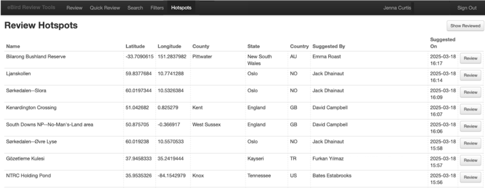

This section describes how to sign in to the Hotspot Review Tools, view hotspot suggestions in your area, open and review a hotspot suggestion, and then accept (or reject) a hotspot. Chrome, Safari, and Mozilla Firefox browsers are all fully supported; other browsers may not work as well. 

1.  Log in to the eBird Hotspot Review Tools (<https://ebird.org/admin/hotspots.htm>) using your standard eBird credentials. If you are logged in to a different account, you will not be able to edit hotspots. We recommend bookmarking this page.

2.  Make sure that you are in the Hotspots tab at the top left of the screen (see below).

**View and Sort Pending Hotspot Suggestions**

The list of hotspots waiting for evaluation in your review region is visible on the default page of the Hotspot Review Tools: <https://ebird.org/admin/hotspots.htm>. You can sort this page by any of the columns; just click the header (e.g., Name, Country), and you’ll be all set. You can also search the list of pending hotspots by using Command+F on a Mac, or Ctrl+F on a PC. 

**Open and Review Hotspot Suggestions**

{fig-align="center"}

It is important to know that **clicking “Review” immediately accepts a given hotspot**, and then allows editing (changing name, location, or merging) to improve it as needed. If it is [not an appropriate hotspot](ToAcceptorNotAccept.qmd), there are just two clicks required: “Review” and then “Revert to personal location” and then the hotspot request is removed and the hotspot will not be created. This tentative acceptance makes the process efficient, but it is important to understand. 

**Note:** For more details and explanations on editing hotspots (including deleting a hotspot and reverting a hotspot to a personal location) refer to the “[Editing Existing Hotspots](EditingExistingHotspots.qmd)” section.