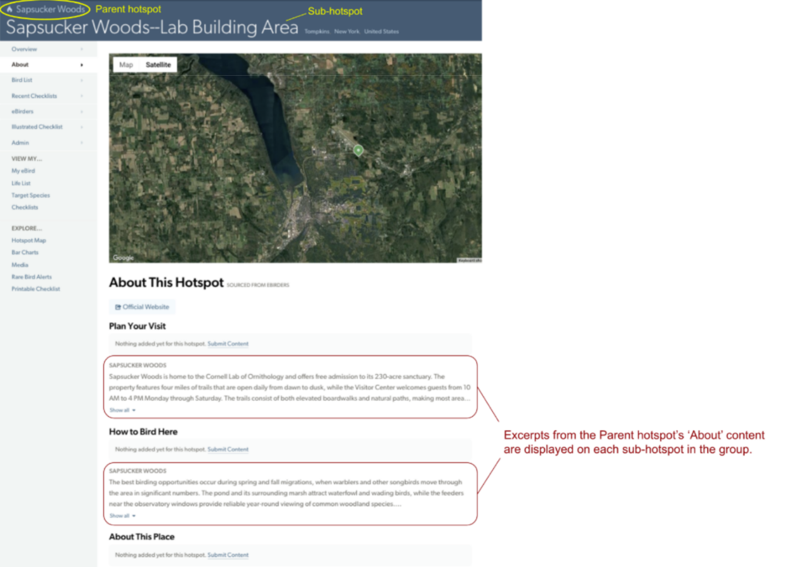

## **Parent Hotspot Content**

### **About Sections**

An excerpt of the parent location's About content appears on each sub-hotspot page. Use the About sections on the parent hotspot to describe information that applies to every hotspot in the group, such as hours, fees, and stewardship details.

### **Features**

Features are unique to each individual hotspot. Use the Parent hotspot's Features to indicate things that are generally true for the entire area. For example, if at least one hotspot in the group has a public bathroom, select 'Yes' for Restrooms on the Parent hotspot. Then select ‘Yes’ or ‘No’ on individual sub-hotspots based on whether that specific site has a bathroom.