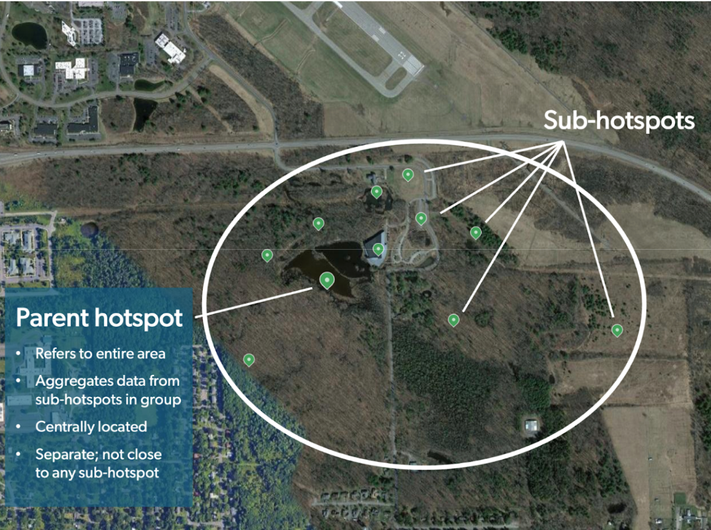

## **Parent Hotspots**

Every Hotspot Group MUST have a **Parent Hotspot**: a location that represents the entire area. The parent location’s Hotspot page serves as an overview for the whole group.

