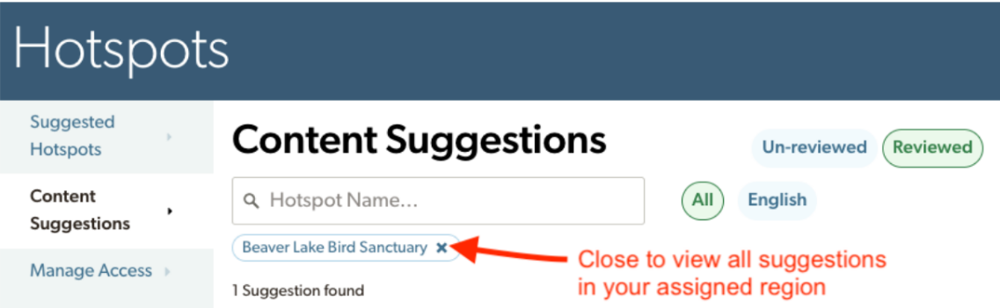

## **Pending Suggestions**

**For pending (un-reviewed) suggestions**, tap “Details” to see what changed

-   **Accept:** anything in GREEN will be added to the Hotspot About page

-   **Decline: anything in RED will be removed from the Hotspot About page**

-   **Close: hide details without acting on them**

WARNING: “Details” shows how the suggested changes will impact the current About page. If the underlying About content has changed since the suggestion was made, the comparison shows what will actually change (not necessarily what the suggester saw at the time of their revisions). 

If you Accept more recent pending suggestions, earlier pending suggestions may no longer apply (i.e., the text being changed may no longer exist on the page) We recommend quickly scanning the Details of all pending suggestions for a single hotspot before Accepting any of them.

**(!)** eBird Hotspot Editors can see the personal account details for the eBirder who made the suggestion, including contact details. People with content editing permissions can only see the name of the person who made the suggestion, with a link to their eBird profile if public. 

{fig-align="center"}

Switch between suggestions for a single hotspot and all hotspots. You can also filter pending suggestions by language