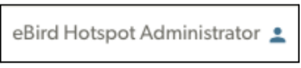

## **Reviewed Suggestions**

After tapping Accept or Decline, the suggestion will move to the “Reviewed” tab. The Details here will show you who made the suggestion and when, whether it was Accepted or Declined, and who reviewed it. 

**eBird Hotspot Administrator**

Any suggestion accepted by “eBird Hotspot Administrator” is an Auto-approved suggestion—i.e., the person who made the suggestion is either an eBird Reviewer/Hotspot Editor OR they submitted \>100+ complete eBird checklists in the previous calendar year.