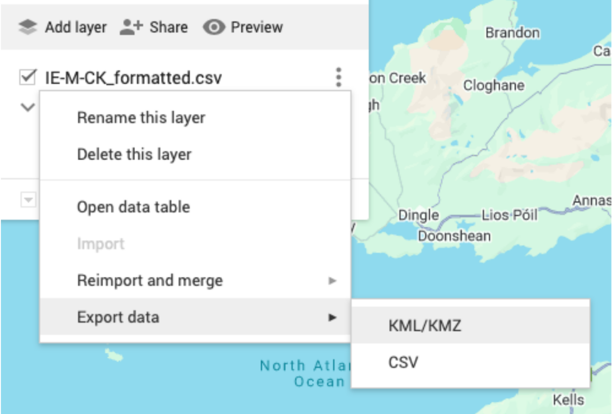

### **View the Hotspot API File in Google Earth**

Hotspot CSV files can also be converted into Google Earth (kml) files. After [downloading the Hotspot CSV](DownloadHotspotFile.qmd), open the file in Excel or similar software. Insert a new, empty row 1. Enter the following column headings into your new row 1: 

-   LocalityID

-   Country

-   Subnat1

-   Subnat2

-   Latitude

-   Longitude

-   Name

-   EditDate

-   Species

Only Latitude (column E), Longitude (column F), and Name (column G) are required for Google Earth. The remaining columns can be deleted if you do not plan to use them in your KML file. 

Save the updated file in CSV or XLSX format. Then, use a KML converter—such as <http://www.earthpoint.us/ExcelToKml.aspx>—to prepare the file for Google Earth. 

Instead of a KML converter, you can create a new personal map on Google Maps (<https://www.google.com/maps/d/>), import your formatted CSV or XLSX file, and then export it as KML/KMZ. 

