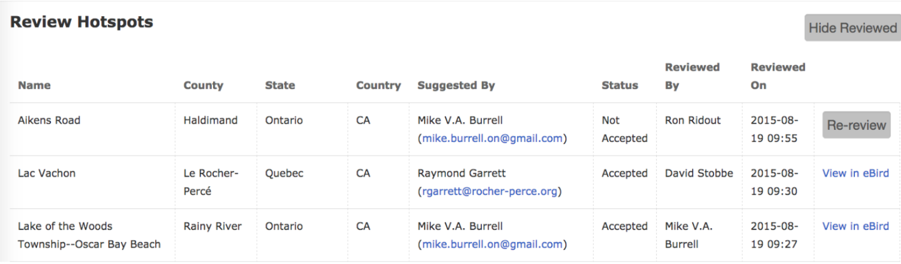

## **Viewing Reviewed Hotspots**

At the top right of the Hotspot Review Tools page, there is a “Show Reviewed” button. Click to see list of all the hotspots that have already been reviewed in your review region except for merged . This page shows who accepted or didn’t accept the hotspot and when.

{fig-align="center"}

All columns on this page are sortable if you click on the header—with the right two being most important. The “Reviewed On” column lets you view by time of review, and “View in eBird” takes you to the Edit hotspot screen where you can revisit hotspot decisions that have already been made.

**Re-review** will re-Accept a hotspot that was previously marked Not Accepted.  giving you the option to review (rename, merge, or move) it again.